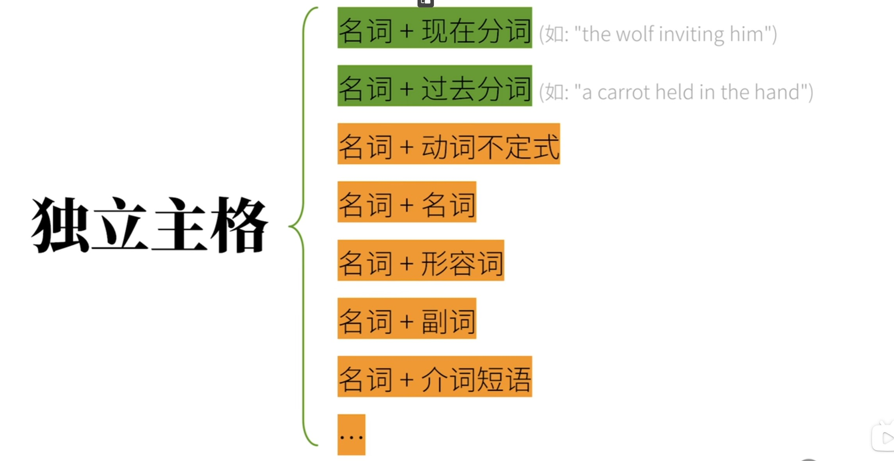

# 非谓语动词 (non-finite verbs)《

也叫**非限定性动词**，
谓语动词也被称为“限定性动词”(finite verbs)

这里的“限定”，是指主语对动词的产生的限制导致动词出现形态上的变化，比如主语的第三人称会导致动词被限定为第三人称单数

故而非谓语动词不具备表达“时体气(TAM)”的功能

*eg：* The rabbit likes **minced** carrots.
句中，like 受到主语限制变为likes ，是限定性动词
minced 不受主语限制，是非限定性动词

**一个简单句中只有一个谓语动词，而句中其他动词必须以非谓语动词的身份出现**

换句话说，**如果想要让动词充当除核心谓语动词以外的句子成分，则该动词必须转化成非谓语动词的4种形式之一**

因此，谓语动词是句子的核心，而非谓语动词出现则在句子的非核心部分

非谓语动词可分为以下4种：

***

## 1. 不定式 (infinitus)

不定式的“不定”是指，动词所表达的行为**不受具体的人和时间限制**，只单纯的表达**行为概念**，通常表达**将要发生的动作**

**完全不定式 (full infinitive)**，形式为 **to + 动词原形**

*eg：*  **To be** or not **to be**, that is a question. *生存还是毁灭，这是个问题。 ――《哈姆雷特》*

在某些情况下 to 还可以省略，被称为**裸不定式 (bare infinitive)**

*eg：*  You helpd me **cook** the carrot.

不定式功能如下：

**1. 不定式作主语**
*eg：*  **To eat** a carrot every day is good for the rabbit.
例句中 To eat 是不定式，充当**主语**

可以使用 **it** 作为 **形式主语** 改写这一句子，即：
It is good for the rabbit to eat a carrot every day. *(句式结构为 It is + adj. + for sb. + to do sth.)*

使用**主语从句**改写句子，即：《
***It*** is good **that the rabbit eats a carrot every day.**

**2. 不定式作宾语**
*eg：*  The rabbit likes **to eat carrots**.
例句中 to eat 作了谓语动词 like 的 **宾语**
**但并非所有动词后都可以接不定式作宾语**

可以使用 **it** 作为 **形式宾语** 改写这类句子：
*eg：*   I consider ***it*** important **to eat a carrot every day**.

**3. 不定式作宾语补语**
*eg：*  The rabbit expected the wolf **to eat a carrot**.
to eat a carrot 补充说明狼的动作，是**宾语补足语**

一些**使役动词《**(例如：see, find, watch, have, make, let...) 后面接不定式作宾补需要省略 to ，即**裸不定式**
*eg：*  Carrots make the rabbit **feel happy**.

还有部分动词后接不定式作宾补时，无论是否有 to 都是正确表达
*eg：*  
The wolf  helped the rabbit **grow** carrots.
The wolf  helped the rabbit **to grow** carrots.

此外，动词不定式作宾语补语时，表示**一个动作从始至终的过程**，强调动作**已经发生了**
*eg：*  
The wolf saw the rabbit **eat** a carrot.
狼之前看到兔子吃了根胡萝卜。

在这一点上与**现在分词作宾语补足语**所表达的含义有所区别《

**4. 不定式作定语**
*eg：* The rabbit has a lot of carrots **to eat**.
由于to eat 与 carrots 存在**动宾关系** (也就是行为和行为作用对象关系)，不定式作定语时**定语后置**

也就是说，当不定式与宾语是**主谓关系**(也就是行为和行为发出者关系)时，不定式作**宾补**
而当不定式与宾语是**动宾关系**时，不定式作**定语**且定语后置

**5. 不定式作表语**
*eg：* The rabbit's dream is **to eat every kind of carrot** in the world.

也可以改写句子，让不定式作主语
*eg：* **To eat every kind of carrot** in the world is the rabbit's dream.

**6. 不定式作状语**
用于表达原因，目的和结果，可以简化**状语从句**《

* **表原因**
*eg：*  I was surprised **to get a thumbs-up.** *(大拇指竖起，也就是赞)*
相当于**原因状语从句**《
I was surprised because I got a thumbs-up.

* **表目的**
*eg：*  I will do anything **to get a thumbs-up**.
相当于**目的状语从句**《
I will do anything in order taht I get a thumbs-up.

* **表结果**
*eg：*  I got enough thumbs-up **to make another video**.
相当于**结果状语从句**《
I got enough thumbs-up, so that I made another video.

**7. 与状态相融合的不定式高级用法**(少见)
*eg1：* The rabbit seemed **to be eating a carrot**.
这兔子之前似乎再吃一根胡萝卜 **（的过程中）**。

*eg2：*  The rabbit will appeat **to have eaten a carrot**.
这兔子之后会看起来像是**吃过了**一根胡萝卜。
***

## 2. 动名词

动名词的本质是将动词转化成名词来使用，因此动名词相当于**名词**，形式是 **动词原形 + ing**

动名词可以承担名词能够承担的一切成分，功能如下：

**1. 动名词作主语**
*eg：*  
**Carrots** are healthy for the rabbit. → **Eating carrots** is healthy for the rabbit.
eating carrots 是**动名词短语**，在句中作**主语**，表达这一行为

**2. 动名词作表语**
*eg：*  The rabbit's hobby is **growing carrots**.

此外，动名词还可以同时作表语和主语
*eg：*  **Seeing** is **believing**. (眼见为实)

**3. 动名词作定语**
*eg：*  a **sleeping** pill.
sleeping 作定语，说明 pill 的用途
也就是 a pill **for sleeping**

**4. 动名词作宾语**
*eg：*  The rabbit likes **eating carrots**.

宾语除了在动词之后出现，也会出现在**介词**之后，这时非谓语动词作宾语，动词形式为**动名词**
*eg1：*  The rabbit **is fond of eating** carrots.

其中，对于词组是以 介词 to 为末尾的短语，此时 to 后面跟**动名词**作宾语，**而非与动词原形构成不定式**

*eg2：*  The rabbit **is looking forward to** ***seeing*** the wolf again.
look forward to 是以介词 to 结尾的词组，后跟动名词 seeing 作宾语

***

一些动词后接**不定式**作宾语，与后接同一动词**动名词**形式作宾语，在语义上会产生不同

*eg1：*  动词 **stop** 

后接动词不定式(即：**stop to do**)，表示停下手中的事去做另一件事
后接动名词(即：**stop doing**)，表示停止现在做的事

The rabbit ***stopped*** **to eat** a carrot.
兔子停下(手里的活)去吃一根胡萝卜。

The rabbit ***stopped*** **eating** a carrot.
兔子停止吃一根胡萝卜。

*eg2：*  动词 **forget** 

后接动词不定式(即：**forget to do**)，表示忘记去做，也就是事情还没有做
后接动名词(即：**forget doing**)，表示忘记做过，表明事情已经做过了

The wolf ***forgot*** **to invite** the rabbit to her party.
狼忘记邀请兔子去她的聚会。

The rabbit ***forgot*** **accepting** the wolf's invitation.
兔子忘记接受狼的邀请。

以下动词和动词词组**只能跟动名词**作宾语

动词：
avoid , advise , consider ,  escape ,  enjoy , mind ,  practice ...

动词词组：
insist on , give up , feel like , put off ...

***

# 3. 现在分词

现在分词基本上算是一个**形容词**，**本身并不表示“现在”这一时间概念**，形式是**动词 + ing**

现在分词暗含**主动关系**，即**被描述的是做出动作的人或物**

现在分词可以充当所有形容词可以充当的成分，功能如下：

**1. 现在分词做定语**
*eg：*  a **talking** rabbit.
这里 talking 是现在分词作**定语**

**现在分词**作定语和**动名词**作定语的区别在于：

现在分词具有形容词性质，可以用来修饰事物的状态
*eg：*  
a **sleeping** rabbit **≠** a rabbit for sleeping
一只沉睡的兔子 
sleeping 是现在分词，表示兔子的状态 **(状态是正在睡觉，睡觉时间不明确)**

动名词具有名词性质，表示事物的功能或属性
*eg：*
a **sleeping** pill **=** a pill for sleeping
一颗安眠药
sleeping 是动名词，表示药片的属性

**2. 现在分词做表语**

*eg：* The story is **interesting**.
故事让人感兴趣。

表语表示主语的性质，特征或状态，用现在分词表示**主动**的意思
因此，表示**动作**的现在分词不能做表语

*eg：*  The rabbit is smart. → The rabbit is **charming**(有魅力的).

这一类现在分词还有：
interest → interesting , excit → exciting , encourage → encouraging

**3. 现在分词做宾语补足语**

现在分词作宾语补足于是强调动作的状态是 **“正在发生”**
这一性质使分词前的**谓语动词**往往是**感官动词**和**使役动词**
比如：see , watch , hear , keep , find , have , get ...

*eg：* The wolf saw the rabbit **eating** a carrot.
狼之前看到兔子正在吃一根胡萝卜。

**4. 现在分词作状语**

现在分词作状语表示时间，原因，条件，结果，让步，目的，方式和伴随情况等

* 表时间
*eg：* **Hearing** the news, the rabbit became excited.
Hearing the news 表示时间
与**时间状语从句**《对应 →
When he heard the news, the rabbit bacame excited.

* 表原因
*eg：*  **Not knowing** what to eat, the rabbit skipped lunch.
Not knowing 表示原因
与**原因状语从句**《对应 →
Because he didn't know what to eat, the rabbit skipped lunch.

事实上，现在分词作状语往往与**状语从句**》相对应，而使用现在分词往往能够简化状语从句

***

# 4. 过去分词

**过去分词**与现在分词具有类似的性质，都**不表示时间概念**
，只表示状态，常见形式是 **动词原形 + ed**，但实际上存在大量的**不规则变化**《

过去分词暗含**被动关系**，即**被描述的是动作的接受者**

过去分词具有以下功能：

**1.  过去分词作定语**

**单个过去分词**作定语时，过去分词具有形容词性质，放在名词前
*eg：*  a **painted** room

过去分词短语作定语时，**定语后置**(放在名词之后)
*eg：*  The carrot cake **eaten by** the rabbit is delicious.
eaten by 是过去分词短语，修饰the carrot cake

**2.  过去分词作表语**

*eg：*  The rabbit is **interested**.
兔子很有兴趣。表明兔子被某件事物引起了兴趣

**3.  过去分词作宾语补足语**
*eg：*  The rabbit found his carrot **stolen**.

**4. 过去分词作状语**
和**现在分词作状语时**具有相同功能》

* 表地点
*eg：*  **Seen** from the hill, the carrot field looks beautiful.
这里过去分词seen 的**逻辑主语**是 carrot field ，两者存在**被动关系**
对应状语从句→
The carrot field looks beautiful where we see **it** from the hill.
it 代指逻辑主语 carrot field

* 表原因
*eg：*  **Born** in a rabbit family, the rabbit has been growing carrots all his life.

* 表条件
*eg：*  **Given** another chance, the rabbit would go to the wolf's party.

***
*补充：*
**1. 现在分词和过去分词作表语时表达含义上的对比**

*eg：*
The rabbit was **frightened**.
兔子感到害怕。

The rabbit was **frightening**.
兔子令人感到害怕。

*原因见词条：现代分词 和 词条：过去分词*》

**2. 现在分词和动词不定式作宾语补足语时表达含义上的对比**

*eg：* 
The wolf saw the rabbit **eating** a carrot.
狼之前看到兔子正在吃一根胡萝卜。

The wolf saw the rabbit **eat** a carrot.
狼之前看到兔子吃了根胡萝卜。

*原因见词条：现代分词作宾语补足语 和 词条：动词不定式作宾语补足语*》

***

## 独立主格

用途在于通常在于简化句子

*eg：*  
原因状语从句：
Because the wolf invited him, the rabbit decided to go to the party.

用独立主格改写句子 → 
**The wolf inviting him**, the rabbit decided to go to the party.

在句中wolf 是动词 invite 的**逻辑主语**且关系为**主动关系**，因此用**现在分词** inviting

也就是说，独立主格中 **“主格”** 是指**非谓语动词的逻辑主语**，
而 **“独立”** 的含义是非谓语动词的逻辑主语**游离于真正主语之外**

存在以下结构：

***

**1. 名词 / 代词 + 现在分词**
动词与逻辑主语为主动关系

*eg1：*
改写由 if 引导的**条件状语从句**
If the weather permits, the rabbit will go out.

→ **The weather** ***permitting***, the rabbit will go out.

**2. 名词 / 代词 + 过去分词**
动词与逻辑主语为被动关系

*eg1：*
改写**结果状语从句**
After the work was finished, the rabbit went home.

→  **The work** ***finished***, the rabbit went home.

*eg2：*
改写**两个不同主语的并列句**，动作同时发生，可理解为**伴随**
The rabbit is lying in bed and a carrot is still held in his hand.

→  The rabbit is lying in bed, **a carrot** still ***held*** in his hand.

**3. 名词 / 代词 + 动词不定式**
动词不定式能够表示将要发生的动作

*eg：*  
**The rabbit** ***to come***, the wolf is overjoyed.
***

以下4种的结构本质是，**包含be** 的独立主格，也就是名词 / 代词 + be动词的现在分词，**省略 being**的简化形式

特别注意，如果只有**人称代词**《，**则 being 不能省略**

**4. 名词 / 代词 + 名词**
*eg：*
Many animals went to the pary, **some of them** ***(being)*** **rabbits and wolves**.

因为是**不定代词**，后面才能**省略 being** ，**直接跟名词**

**5. 名词 / 代词 + 形容词**
*eg：*
Many animals went to the pary, **some of them** ***(being)*** **happy**.

同样是**不定代词**，后面能**省略 being** ，**直接跟形容词**

**6. 名词 / 代词 + 副词**
*eg：*
The rabbit sat on a chair, **head** ***(being)*** **down**.
这里的 down 是副词

**7. 名词 / 代词 + 介词短语**
*eg：*
The rabbit came in, **carrot** ***(being)*** **in hand**.
***

*补充：*
**with 结构**

是指 **with + 宾语 + 宾语补足语**，这种结构的本质是独立主格结构

*eg1：*
句子中 with 可以直接省略
The work finished, the rabbit went home.
→ **With the work finished**, the rabbit went home.

*eg2：*
句子中 with 省略的同时，进一步简化句子
The rabbit came in, **with a carrot in his hand**.
→ The rabbit came in, **carrot in hand**.

***